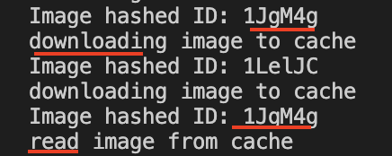

# Cacheable Image Gallery App

This project was created with [Expo init](https://docs.expo.io/get-started/create-a-new-app/) to create the skeleton of the structure.

## Libraries & Packages

  these libraries and packages was used to develop this app;

- [NativeBaseUI](https://nativebase.io/) for design.
- [axios](https://www.npmjs.com/package/axios) for fetching data from API
- [expo-file-system](https://docs.expo.io/versions/latest/sdk/filesystem/) for creating cache mechanism
- [react-native-snap-carousel](https://github.com/archriss/react-native-snap-carousel) for image gallery template.
- [shorthash](https://www.npmjs.com/package/shorthash) for generating short hash id to the image file path for better readability.

Also, I used [prettier](https://prettier.io/) plugin for formatting my code.

## Installation

- `yarn install`
- `npm install`

## Run the App

- `expo start or npm start`

## Testing

I added some console.log() for you to test caching mechanism easily.

- `When you swipe right to see another image you will see this kind of message that indicates the image is cached if it is not in the cache`

- `If you swipe left and right again to see images, it will render from cache instead of downloading again. So you will see this console log in the terminal;`

